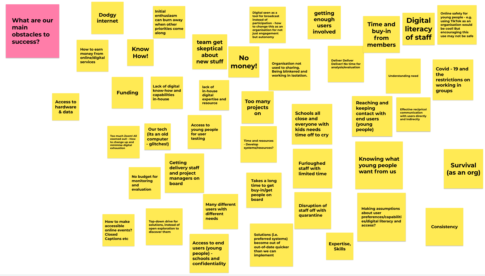
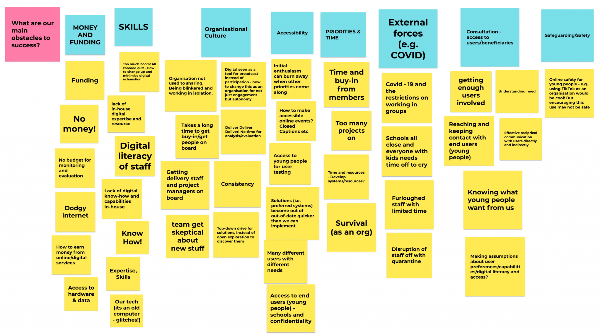
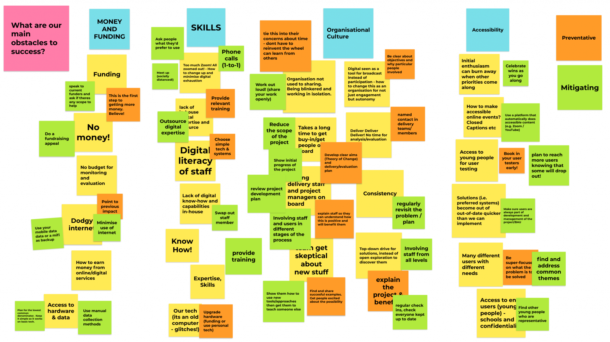

# Pre-mortem

*Category: Discovery* · Originally published on [Learn with WAO](https://web.archive.org/web/20250211083310/https://learnwith.weareopen.coop/pre-mortem/) (Wayback Machine link)

We all know what a post-mortem is, right? It's something that you do after something or someone has died, and is an important learning process. But what about a pre-mortem?

The point of a pre-mortem is to create a 'safe space' to take a look at project risks. All you do is imagine it's six months / a year / however long into the future and the project has failed. The job of the pre-mortem is to identify in advance why that might happen.

| | |
|---|---|
| **Target group** | project team, single employees |
| **Time** | 45 minutes |
| **Material** | online sticky notes tool |
| **Goals** | Determine factors that could bring a project towards failing and thereby prevent it |

*Some results from a recent Catalyst-funded project:*

Use your favourite online platform for sticky notes. We often use [Whimsical](https://whimsical.com) because it's so simple, but you might also want to try [Miro](https://miro.com) or [Mural](https://mural.co). The first thing to do is to add a single sticky note to the shared online space with the question: **What are our main obstacles to success?**

Participants imagine reasons for project failure, based on what they know, and add sticky notes to the shared space. Spend a good period of time allowing people to put down anything they like.

Next, ask participants to spot similarities and themes that are emerging. Give those themes a name, and use a different coloured sticky note for each one. The next job is to organise all of the sticky notes under those headings, as much as possible. Everyone can do this at the same time. Try not to duplicate sticky notes unless absolutely necessary.

The last thing to do is to think through how to manage these risks to the project:

- **Preventative actions**: what can we do to stop that risk occurring?
- **Mitigating actions**: if the risk starts happening, what can we do to lessen its impact?

Do one type of risk at a time, and use different coloured sticky notes for each. Allow time at the end to change the colour of a sticky note if someone thinks a mitigating action should be preventative action (or vice versa). All that's left to do now is to get it all put into a spreadsheet as your risk register!
